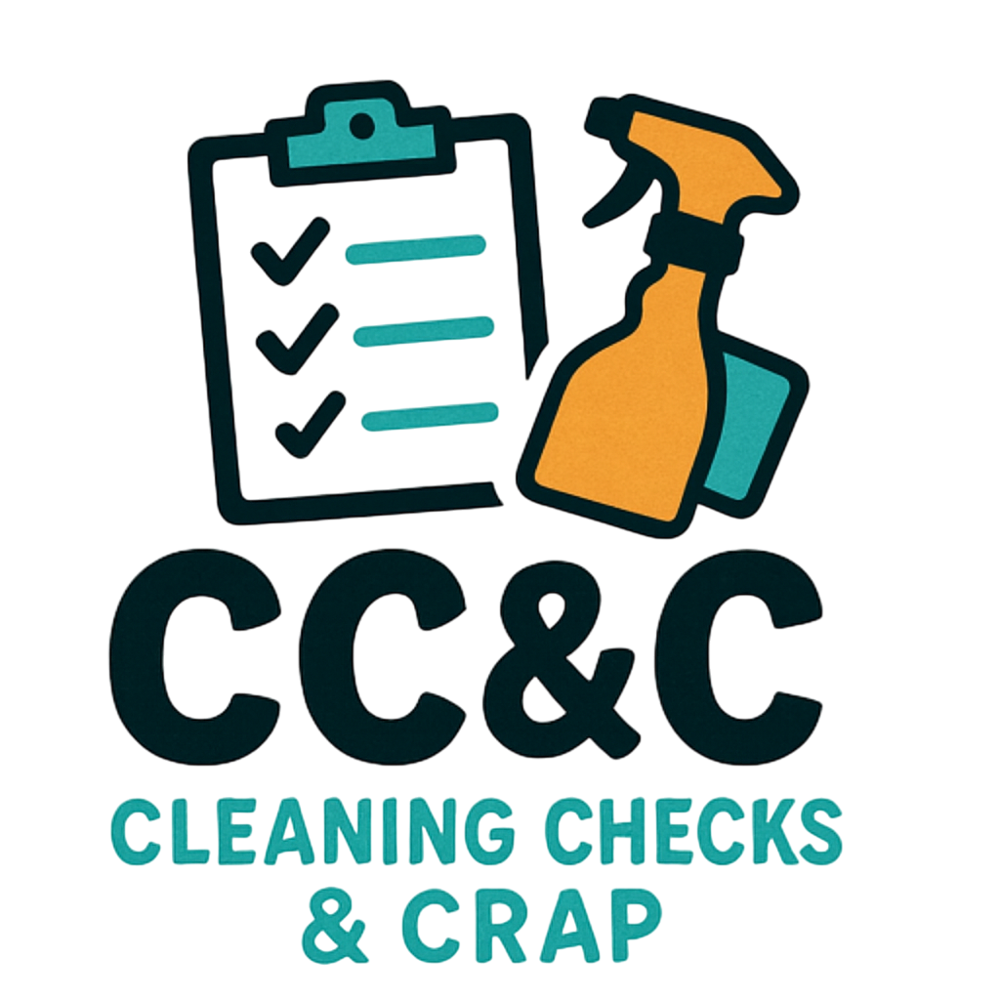

Cleaning Checks & Crap

<a href="#what">Main</a>
<a href="#how">How It Works</a>
<a href="#pricing">Pricing</a>
<a href="#testimonials">Testimonials</a>
<a href="#book">Book Now</a>

<h1>Cleaning Checks & Crap</h1>
<h2>– "We pass your cleaning checks so you don't have to!"</h2>

<h2>What We Do</h2>

We take care of your apartment cleaning checks for you. Whether it's scrubbing the bathroom, vacuuming the carpet, or wiping down counters—we do it all so you don't get fined or fail your check. Our professional team ensures your space meets all inspection requirements while you focus on what matters most to you.

  <h2>How It Works</h2>
  

    Booking with us is simple and stress-free. Just schedule an appointment online or by phone, provide your address and preferred time, and our experienced team will take care of the rest. All appointments must be booked at least <strong>1 day in advance</strong> to ensure proper scheduling and preparation.
      

    On the day of your cleaning, we ask that <strong>at least one roommate is present</strong> during the appointment. This ensures a smooth handoff, allows access to the apartment, and provides mutual protection against any potential disputes or false claims.
      

    We bring all necessary cleaning supplies and ensure your space is thoroughly cleaned and <strong>inspection-ready</strong> according to typical student housing standards.
      

    <strong>Customer Satisfaction Guarantee:</strong> If our cleaning does not pass inspection, we will provide a <strong>full refund</strong>, including reimbursement for any cleaning-related fees or fines you incur as a result. We stand behind the quality of our work.
      

    <strong>Discounts & Deals:</strong> 
    • <strong>Bulk Deals:</strong> Discounts for multiple rooms or apartments cleaned at once 
    • <strong>Time-Based Discounts:</strong> Book 10 or more days in advance and get 20% off 
    • <strong>Subscription Discount:</strong> Sign up for monthly cleanings and receive a discounted rate  

    Our mission is to help you pass your cleaning checks with zero hassle. Fast, affordable, and fully guaranteed.
  

  <h2>Pricing</h2>
  

    <strong>Individual Services:</strong> 
    • Room: $35 
    • Bathroom: $25 
    • Kitchen: $30 
    • Living Room: $30 
    • Deep-Cleaning Fee (if requested or required): +$30 
    • Early Booking Discount (10+ days in advance): -20%  

    <strong>Combo Packages:</strong> 
    • Room + Bathroom: $55 (save $5) 
    • Kitchen + Living Room: $55 (save $5) 
    • Full Apartment (Room + Bathroom + Kitchen + Living Room): $110 (save $10)  

    <strong>Roommate & Group Discounts:</strong> 
    • 2 Rooms cleaned: $65 (save $5) 
    • 3+ Rooms cleaned: $30 per room (save $15+ total)  

    <strong>Additional Info:</strong> 
    • All cleanings are inspection-ready and tailored to typical student housing standards. 
    • If ANY cleaning checks come back failed, a full refund will be made, as well as any fee paid for 
    • Flexible scheduling and satisfaction guaranteed.  

    Book early and save! Let us handle the mess so you can stress less.
  

<h2>Testimonials</h2>

Coming Soon!

<h2>Book Now</h2>

To book an appointment for us to come to your apartment to complete your cleaning check, please either contact us through email or by filling out the form below. Thank you!

<a href="https://docs.google.com/forms/d/e/1FAIpQLSfWYVfLmmCOcZTjRhamiC-byDUJAnuUORYGc9BIxGVTzmEnqg/viewform?usp=header" target="_blank" class="book-btn">Book Now</a>
or contact us through our email:
cleaningchecksandcrap@gmail.com
<button class="copy-btn">Copy</button>

