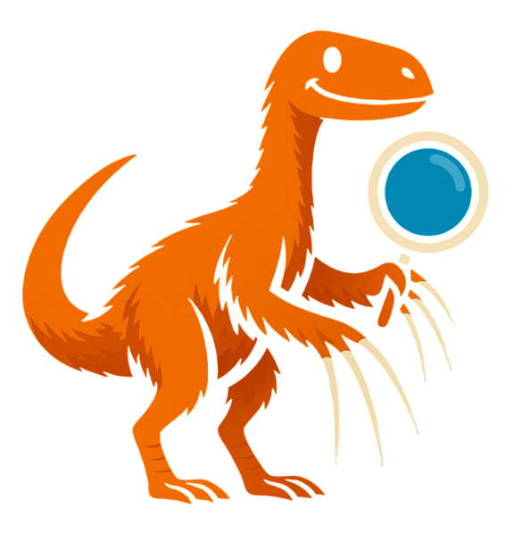

🎨 Comprehensive GUI Panel

Text Inputs

<input class="gui-input" type="text" placeholder="Enter your name..." style="margin-bottom: 16px;">
<textarea class="gui-textarea" placeholder="Type something cool here..."></textarea>

Dropdowns & Selection

<select class="gui-select">
<option>Choose an option...</option>
<option>Option 1</option>
<option>Option 2</option>
<option>Option 3</option>
</select>

Checkboxes & Radio Buttons

<label class="gui-checkbox">
<input type="checkbox"> Enable notifications
</label>
<label class="gui-checkbox">
<input type="checkbox" checked> Auto-save
</label>

<label class="gui-radio">
<input type="radio" name="theme" value="light"> Light theme
</label>
<label class="gui-radio">
<input type="radio" name="theme" value="dark" checked> Dark theme
</label>

Sliders & Toggles

<input type="range" class="gui-slider" min="0" max="100" value="50">

<label class="gui-toggle">
<input type="checkbox">

</label>

Progress Bar

Tabs

<button class="gui-tab active">General</button>
<button class="gui-tab">Advanced</button>
<button class="gui-tab">Security</button>

Cards

Card Title

This is a card component with some example text content that shows how cards look in your GUI.

Badges & Tooltips

Default
Success
Warning
Error

Hover me
Tooltip text!

Buttons

<button class="gui-button save">Save</button>
<button class="gui-button">Export</button>
<button class="gui-button">Preview</button>
<button class="gui-button cancel">Cancel</button>
<button class="gui-button delete">Delete</button>

