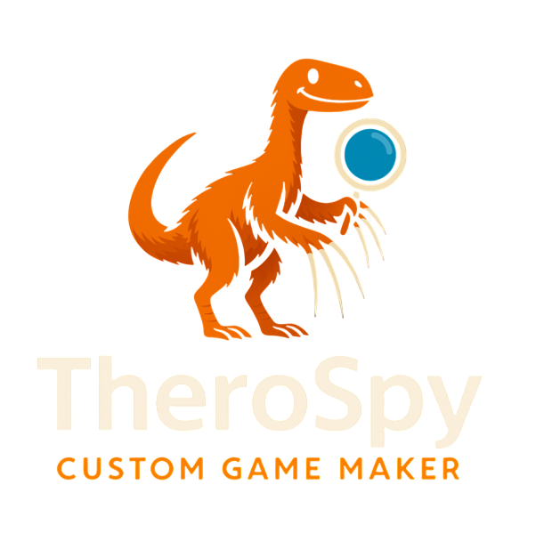
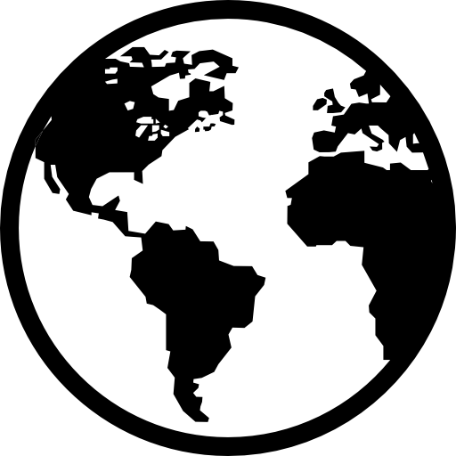

<!-- MAIN INTERFACE -->

PAGE 1

Add Background

Add Image/Video

Add Shape

GUI Editor

Add Audio

Effects Editor

Cursor Editor

<!-- NEW SLIDING FILE MENU -->

<button class="file-menu-item" onclick="event.stopPropagation(); saveAs()">Save As</button>
<button class="file-menu-item" onclick="event.stopPropagation(); saveFile()">Save</button>
<button class="file-menu-item" onclick="event.stopPropagation(); uploadFile()">Upload</button>
<button class="file-menu-item" onclick="event.stopPropagation(); openFile()">Open</button>
<button class="file-menu-item" onclick="event.stopPropagation(); shareFile()">Share</button>
<button class="file-menu-item" onclick="event.stopPropagation(); ExportFile()">Export</button>
<button class="file-menu-item" onclick="event.stopPropagation(); ImportFile()">Import</button>
<button class="file-menu-item" onclick="event.stopPropagation(); viewCode()">View Code</button>
<button class="file-menu-item" onclick="event.stopPropagation(); ToolsFile()">Tools</button>
<button class="file-menu-item" onclick="event.stopPropagation(); openHelpPopup()">Help</button>
<button class="file-menu-item" onclick="event.stopPropagation(); previewGame()">Preview Game</button>

🗑️

⌂

100%

Global

