

# Paintings
#### Description
Okay, so I know they are not spectacular, but keep in mind that the first painting I ever did was maybe five months ago. I have always been artistic and I love to try new things, so I kind of picked this up as my hobby. I expect that the more I paint, the better I will get at it. The first painting I ever did is in here, it is the big one of the Milky Way Galaxy - because of my love for space. The second one I did is the Big one of Stranger Things will the orange and red clouds. Many of these paintings are from my favorite movies and shows, like 'Interstellar', 'Inception', and 'Stranger Things'. I have plans to make a painting for 'Life of Pi', as it is also one of my favorites. I mostly am doing poster-like paintings, just because I like those ones better. I plan to keep uploading my work here, so stay posted for new ones!

  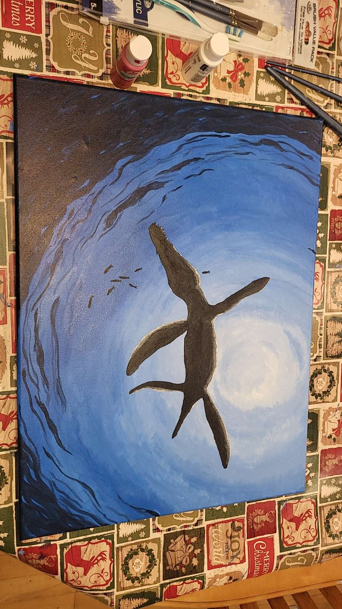
  
  
  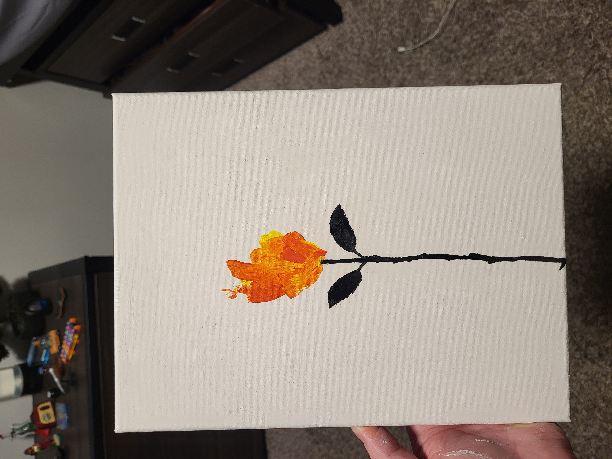
  
  
  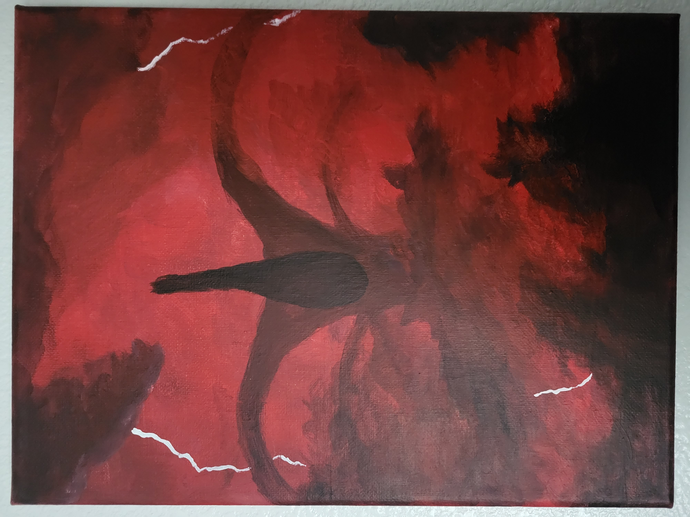
  
  
  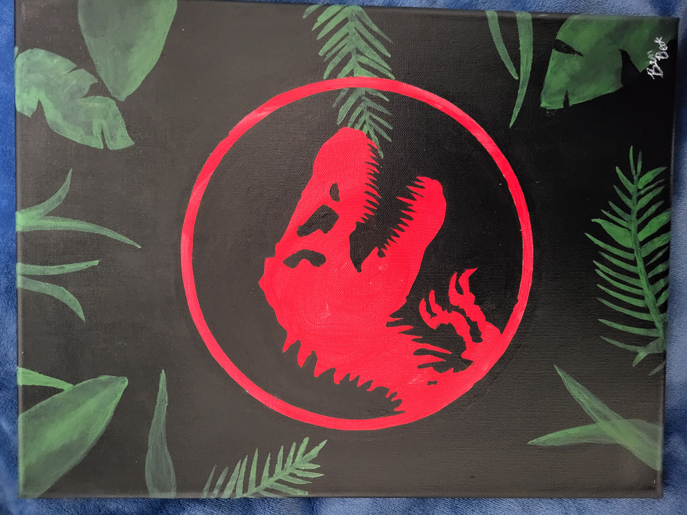
  
  
  
  

 

# Clay Projects
#### Description
These are my Clay Projects! There won't be as many on here, as I mostly do painting and drawing, but I also kind of just picked this up as a hobby, so there will be much more coming out! The blue monster and green dinosaur I chose from looking at online projects done, and thought they would be really fun. The red robot is from one of my new favorite games called "REPO". I have a few more that I am currently working on, so stay tuned!

  
  
  

 

# Dinopedia
#### Description
Aside from how much I love movies and shows, I also love dinosaurs and prehistoric life! I also love to draw, so I created a "dinopedia" where I can draw out my favorite animals and create short descriptions of each one! (Also there are a few fictional creatures from movies or shows)

  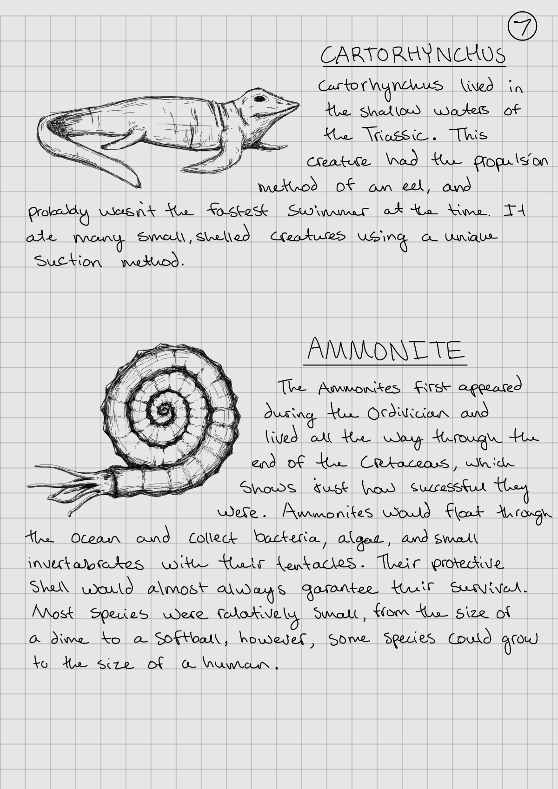
  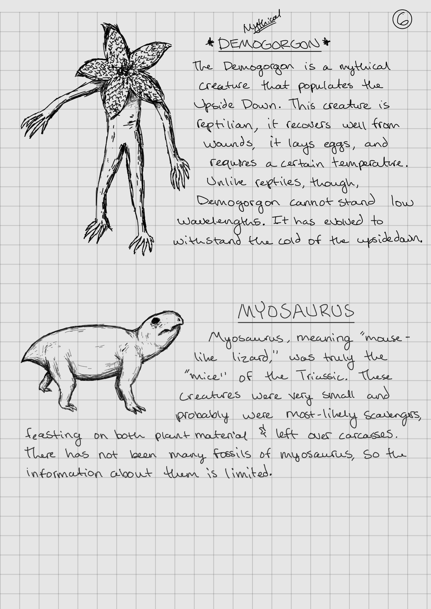
  
  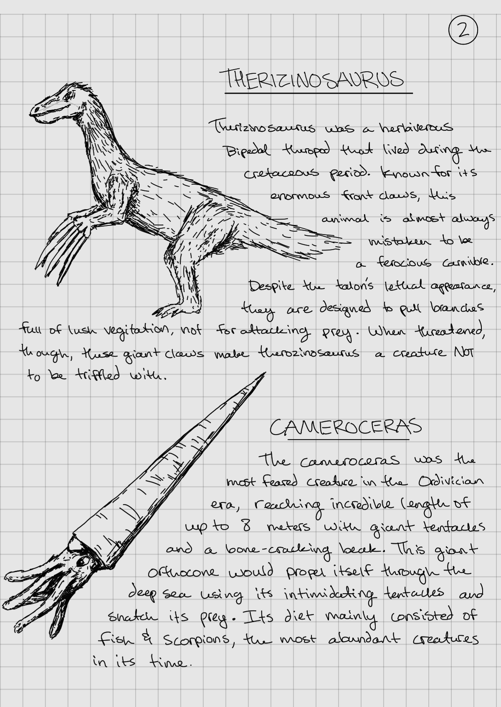
  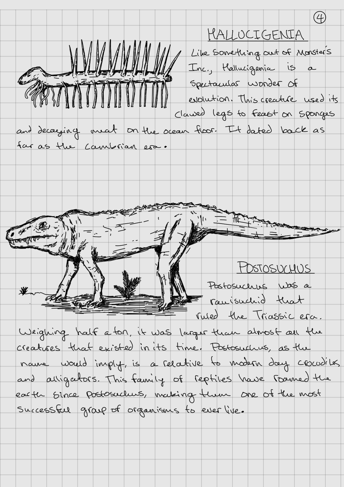
  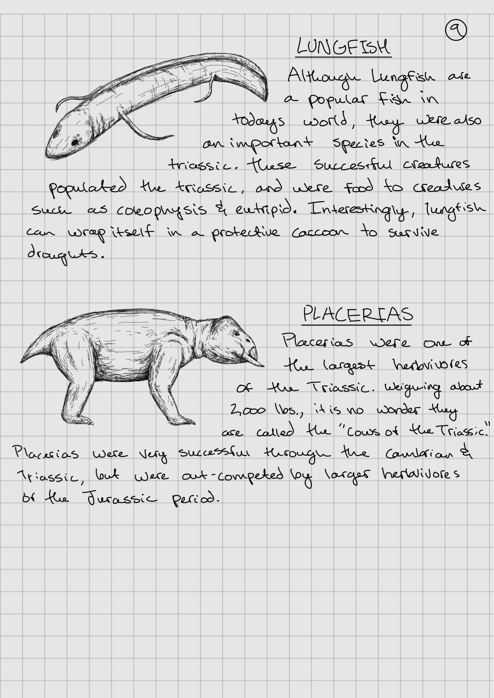
  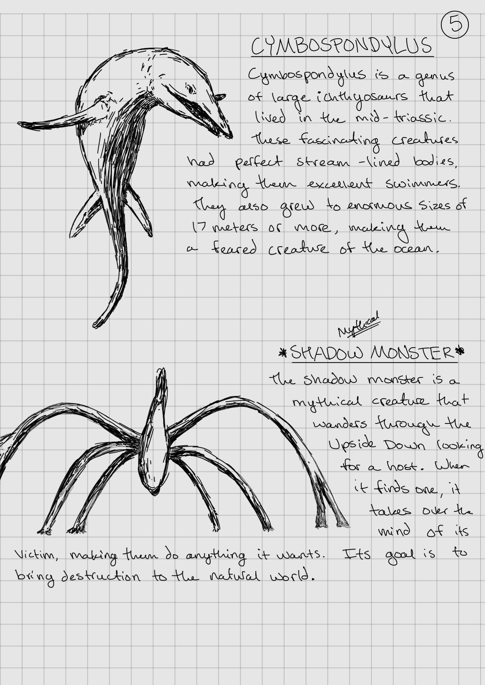
  
  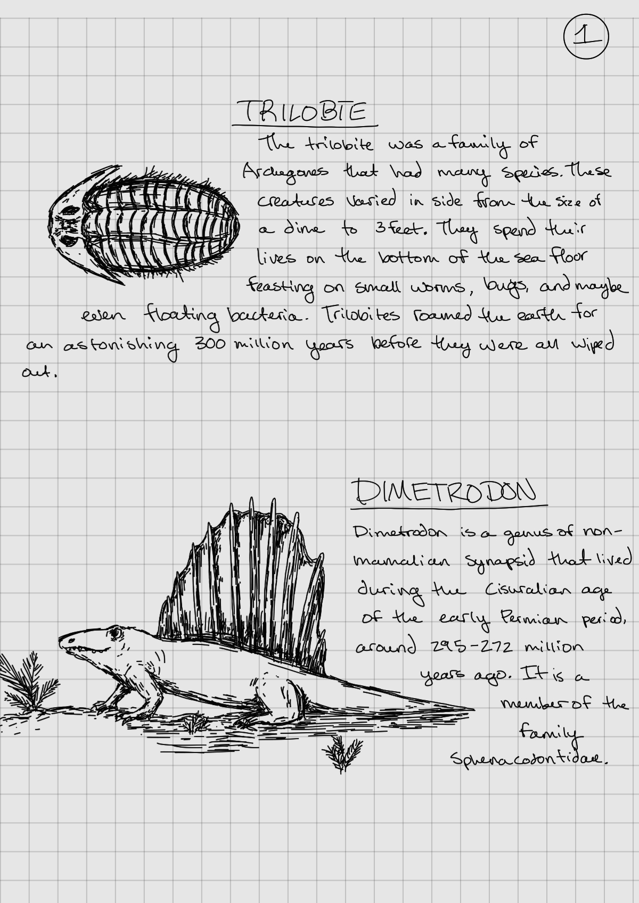
  
  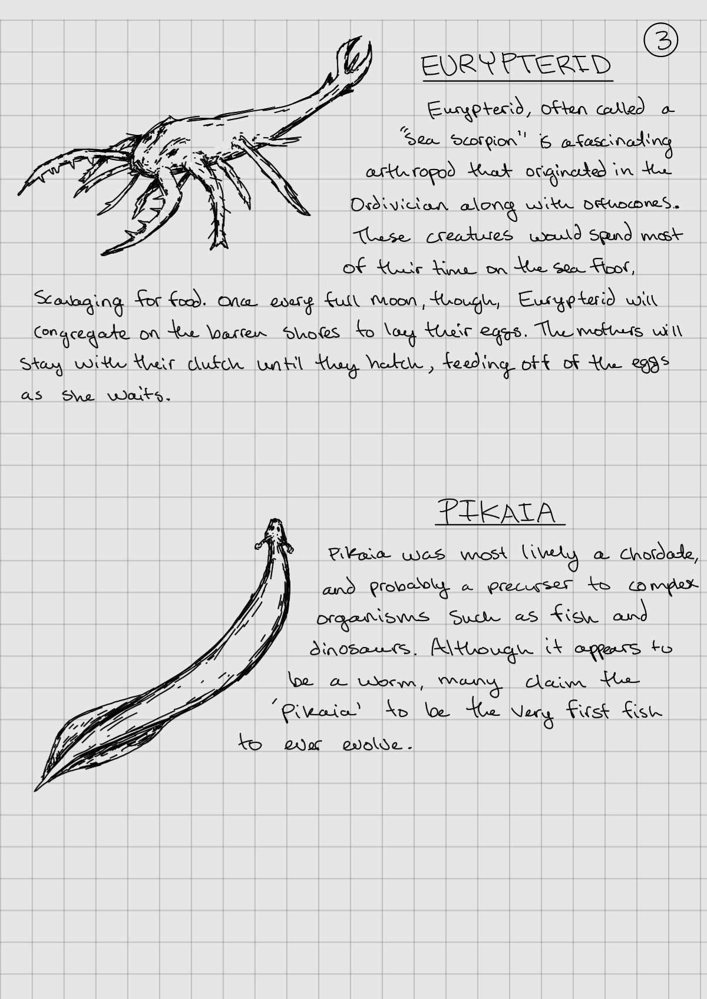
  
