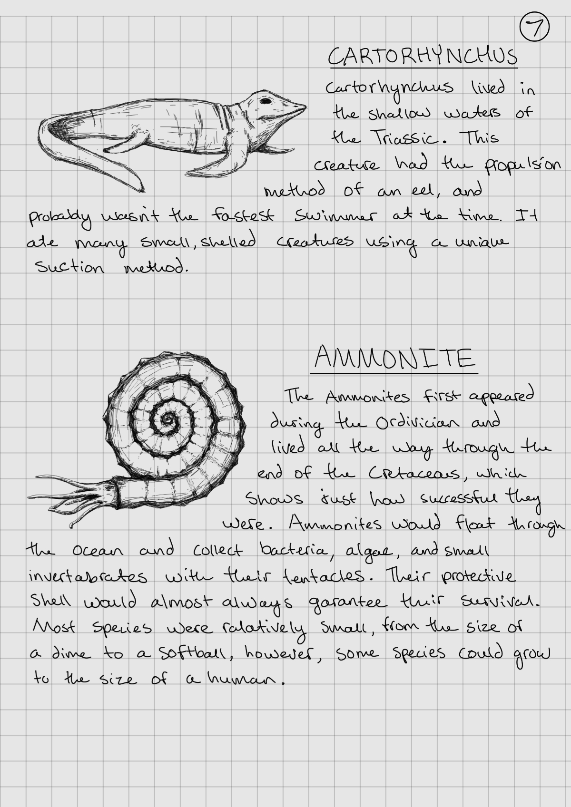
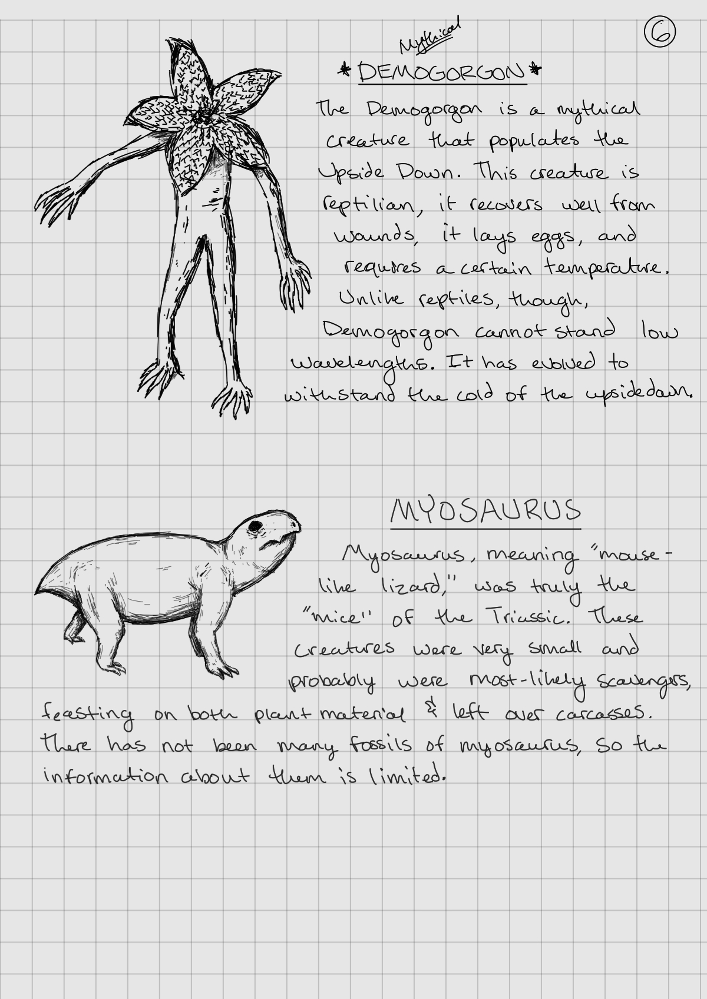
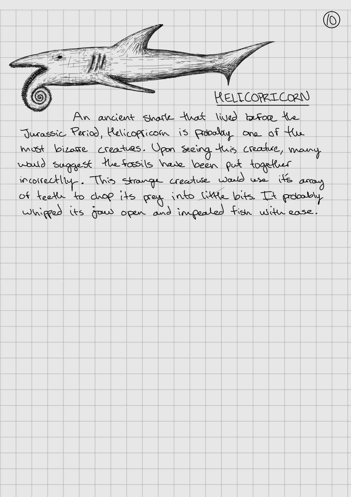
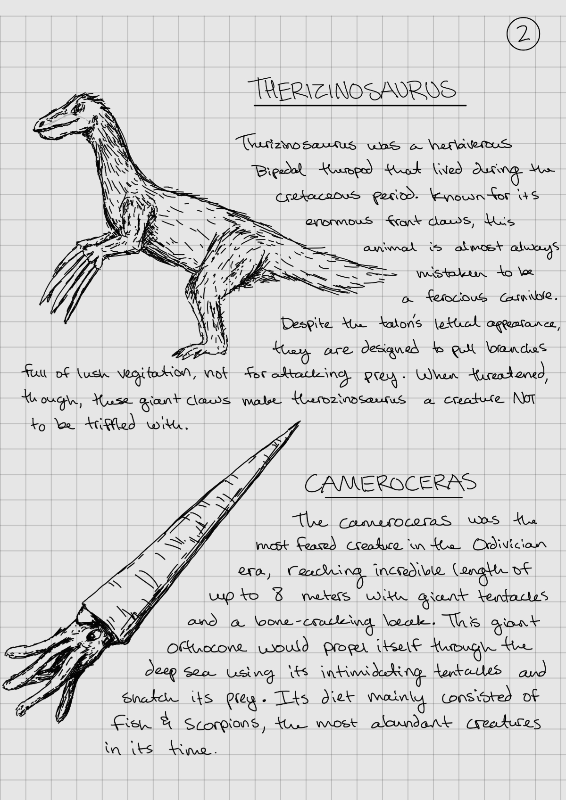
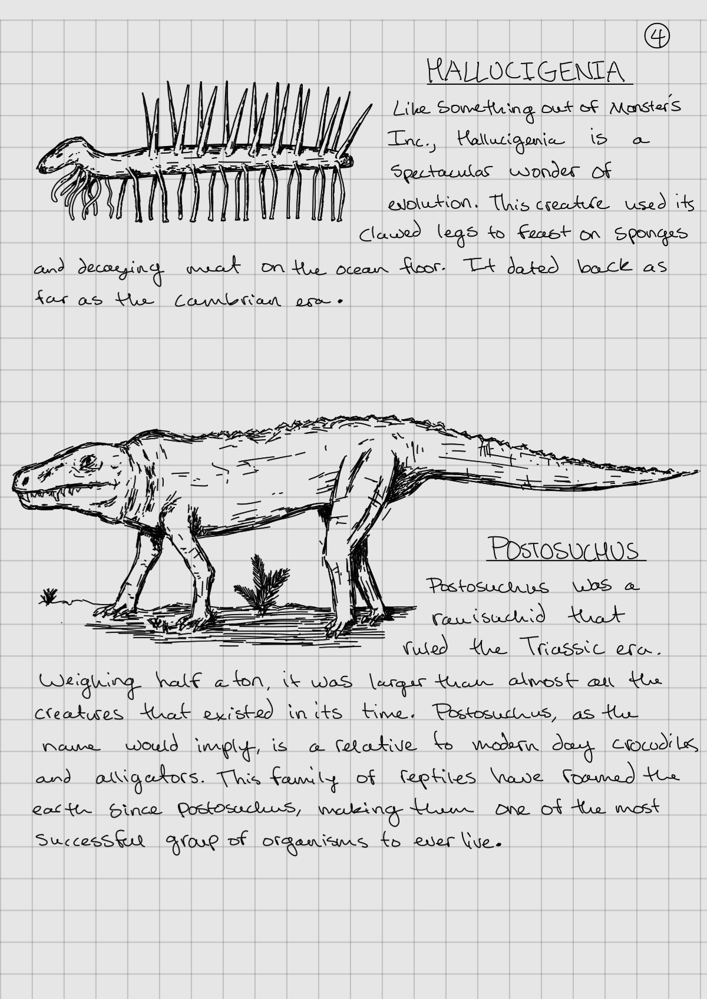
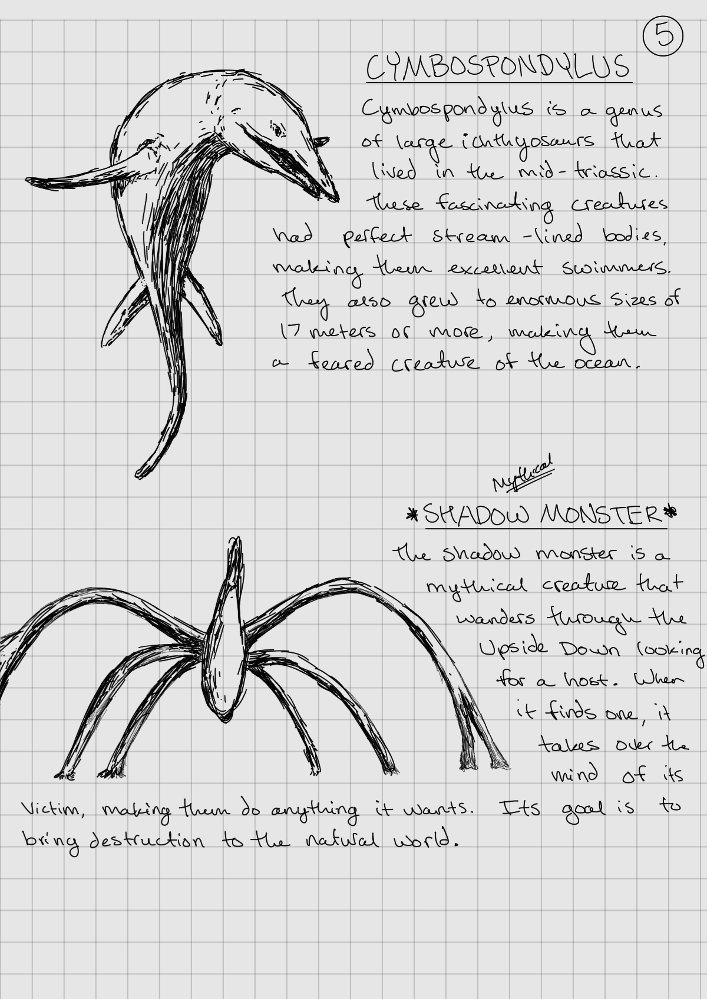
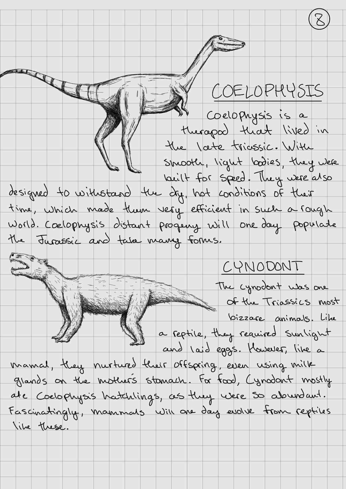
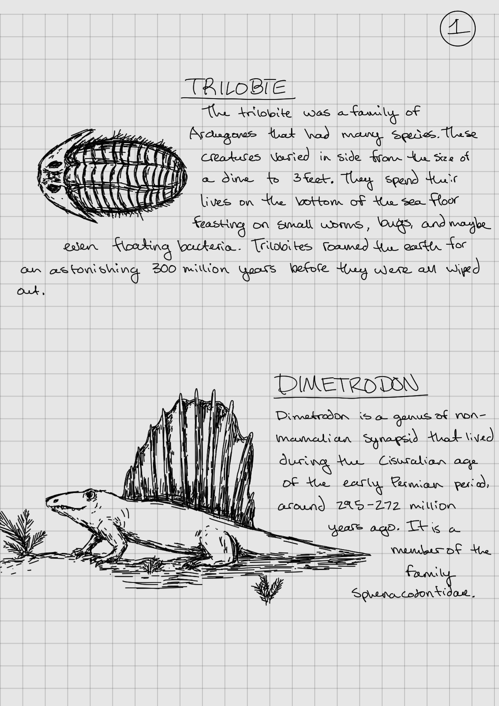
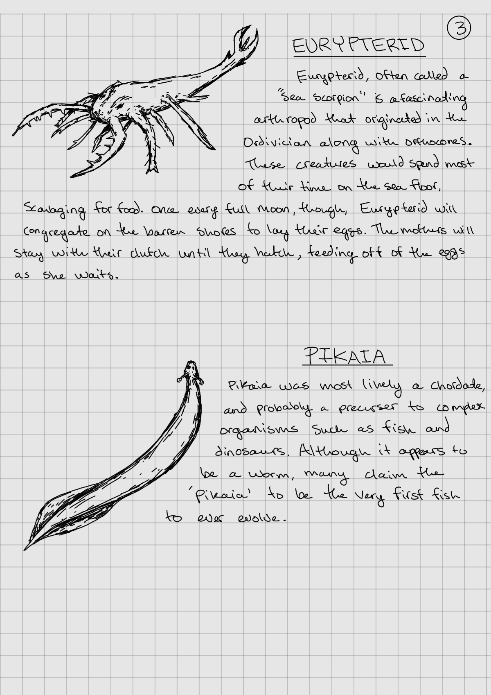

# Paintings
#### Introduction
Okay, so I know they are not spectacular, but keep in mind that the first painting I ever did was maybe five months ago. I have always been artistic and I love to try new things, so I kind of picked this up as my hobby. I expect that the more I paint, the better I will get at it. I mostly am doing poster-like paintings, just because I like those ones better. I plan to keep uploading my work here, so stay posted for new ones! 

Here is my *Star Wars* painting! We have Anakin Skywalker fighting Obi-Wan Kenobi on Mustafar, inside of Darth Vadar's iconic helmet. We also have the Death Star and the main title, giving the painting a nice touch. 

This is the Mocking Jay from the movie series *The Hunger Games.* The symbol in this painting was probably spray painted long ago on a wall now overgrown with vegetation. This also would be a cool concept for *The Last of Us*, I might have to do one for that show, too.

Here is the Shadow Monster from *Stranger Things*, lurking through the clouds.

I saw something similar to this on the Instagram, thought I might make one. It was not a cheap painting.

*Indiana Jones*, of course

This was the origional painting of the Mocking Jay, which gave me inspiration to make the 3d painting above.

This is the album cover of the *Imagine Dragons* song, "Wrecked." The song meant a lot to me during the time I painted this.

This painting I screwed up on just a little, but I plan on fixing it. From the Movie *Inception*, just in case you can't read the words on the painting.

In this painting, you have one of my favorite prehistoric sea reptiles: *Liopleurodon*.

I think this one is a really cool one. From the show *Stranger Things*, we have Max getting attacked by Vecna, who is in the upside down. I like the symmetry in it, too.

This is probably my favorite painting out of the ones I have done so far. I am obsessed with *Interstellar*, as it is just one of the most beautiful movies out there. I think this one really portrays some of the beauty that is found in space and the movie.

*Jurassic Park*, one of my favorite movies

This is my second painting! I don't really love the clouds, but they were tricky and I'm still learning.

  

Here is my first painting! It is simply of the Milky Way Galaxy, because I love space a lot.
 

# Clay Projects
#### Introduction
These are my Clay Projects! There won't be as many on here, as I mostly do painting and drawing, but I also kind of just picked this up as a hobby, so there will be much more coming out!

  
  

This Red guy is actually a robot from the video game *REPO*. 

 

# Dinopedia
#### Introduction
Aside from how much I love movies and shows, I also love dinosaurs and prehistoric life! I also love to draw, so I created a "dinopedia" where I can draw out my favorite animals and create short descriptions of each one! (Also there are a few fictional creatures from movies or shows)

  
  
  
  
  
  
  
  
  
  
  
  
