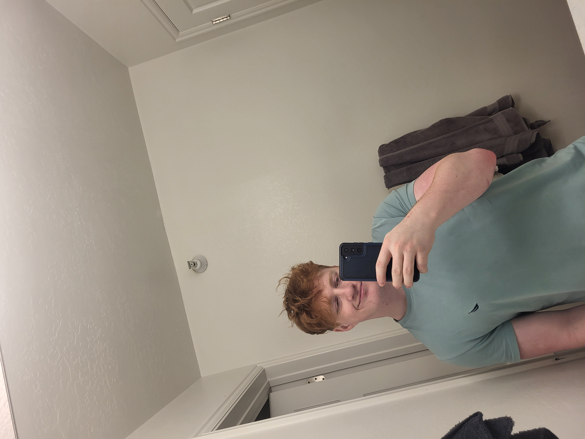

## Who I am
Hi, I'm Benjamin Beck, and I’m from American Fork, Utah. Ever since I was young, I’ve been passionate about biology—especially evolutionary science. That passion led me to pursue a career in the biological sciences, starting with participation in the STEM science fair during high school. My project focused on the effects of Nicotinamide Riboside (NR) on cell growth and proliferation, for which I received the Reoch Award.

After high school, I began my college journey at Utah Valley University, where I earned my Associate's Degree in 2022. From 2022 to 2023, I served a full-time LDS mission, which was a meaningful and transformative experience. Upon returning, I resumed my education and made the decision to shift my focus from Biology to Bioinformatics, combining my love for science with a growing interest in computers and data analysis.

I’m currently working toward my Bachelor’s degree in Bioinformatics, with the goal of developing innovative research projects that integrate biology and technology.

Outside of academics, I enjoy movies, video games, weightlifting, exploring the outdoors, and creating digital and traditional art. I’ll be sharing some of my artwork on this site—feel free to check it out!

In terms of work experience, I spent five years at Carson Meats (now Mosida Market) in Lehi, where I developed a strong work ethic. I now work at Panda Express and plan to continue working there while I complete my degree and build a career in bioinformatics.

## Education

Bachelor of Science in Bioinformatics
Utah Valley University — Expected 2027

Associate of Science
Utah Valley University — 2022

High School Diploma
American Fork High School — 2020

## Projects
<a href="Final_Project_Biol_3100/Final_Biol3100.html">Final Project (Biol 3100)</a>

<a href="Oral_Microbiome_Research/Oral_Microbiome_Research.html">Oral Microbiome Research (MICR 3455)</a>

<a href="My_Art/My_Art.html">My Artwork</a>
